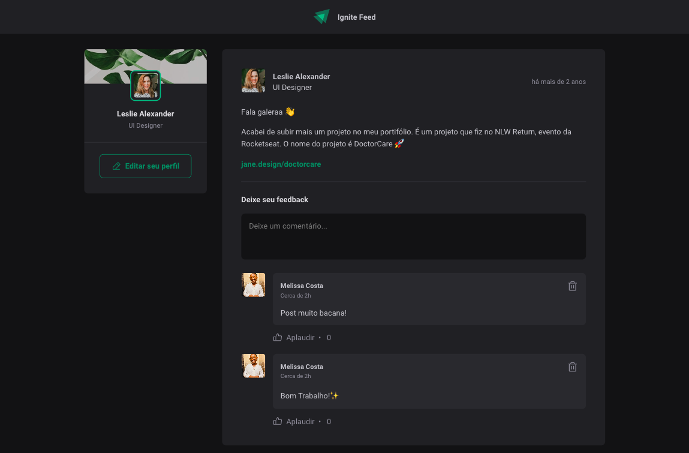

# Ignite Feed

Ignite feed é um projeto simples que simula o feed das redes sociais,  com funcionalidades de comentários, likes e apagar comentários.

## Funcionalidades

<ul>
  ✅ - adicionar comentários 
  ✅ - aplaudir (likes) 
  ✅ - apagar comentário 
</ul>

## Como usar

1. Clonar repositório
   `git clone https://github.com/mellcosta/ignite-feed.git `

2. Instalar dependências
   `yarn` ou `npm i`

3. Subir projeto Local
   `yarn dev` ou `npm run dev`

4. Acessar projeto
   `http://localhost:3000/`

## Tecnologias utilizadas

<ul>
  <li>ReactJS</li> 
  <li>Vite</li> 
  <li>React Dom</li> 
  <li>Date-fns</li> 
  <li>Phosphor-react</li> 
</ul>

## Considerações finais

### Desenvolvido por `Melissa Costa - @mellcosta`
