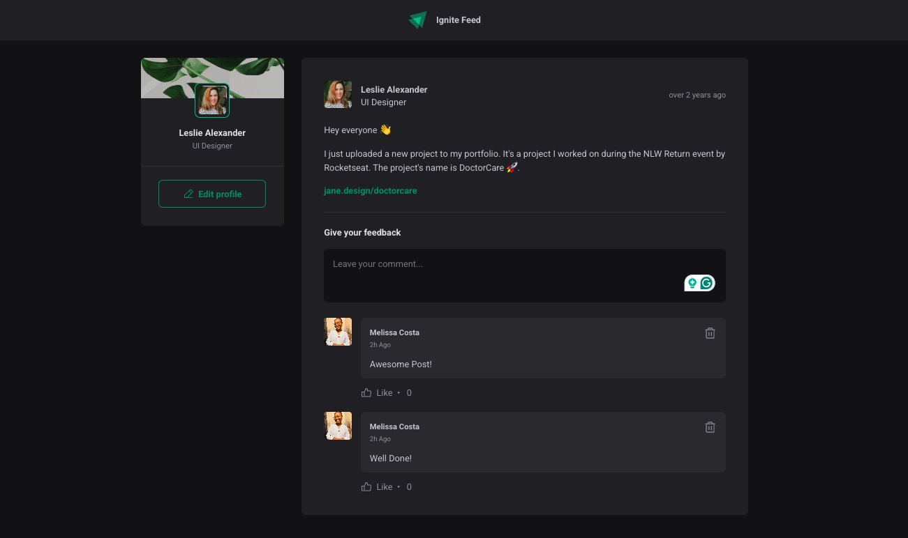

# Ignite Feed

Ignite feed  is a simlpe project which simulates your social media feed,  with features like comment, likes and delete comments.

## Features

  ✅ - add comments

  ✅ - clap (likes)

  ✅ - delete comment

## How to use?

1. Clone the repository
   `git clone https://github.com/mellcosta/ignite-feed.git `

2. Install dependencies
   `yarn` or `npm i`

3. Run the local project
   `yarn dev` or `npm run dev`

4. Click the link 
   `http://localhost:3000/`

## Technologies

<ul>
  <li>ReactJS</li> 
  <li>Vite</li> 
  <li>React Dom</li> 
  <li>Date-fns</li> 
  <li>Phosphor-react</li> 
</ul>

### Developed by `Melissa Costa - @mellcosta`
